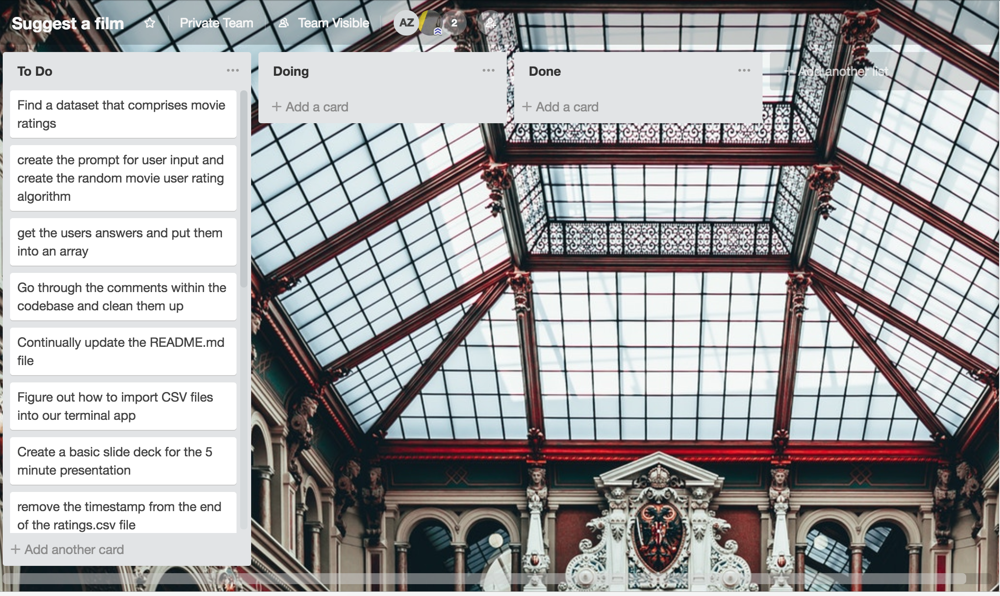
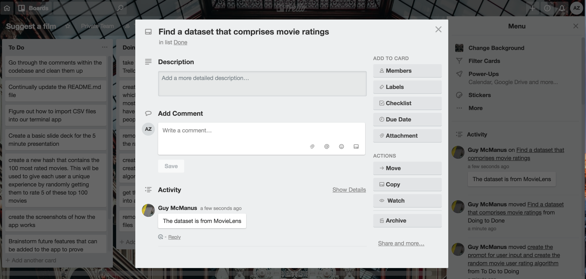

# README.md  - Suggest A Film
---
 
 ## What Suggest A Film can do for you!
 Suggest A Film will give you movie recommendations based off random movie ratings you provide to us.

It is as simple as 1,2,3.  
1) Rate a few movies.
2) Recieve recommendations based on your ratings.
3) Watch one of the movies we suggest, or ignore our suggestions and go for a walk, or have a drink, or write a symphony - it's entirely up to you it's your life!

---

##   Features
We used the MovieLens dataset. It is available for free at https://grouplens.org/datasets/movielens and provided in CSV format.  

In order to compare your movie ratings with the movie ratings of other people. Then we used the gem _'Pearson'_ to calculate the Pearson Correlation Coefficient to calculate the users similarity score.  This similarity score is then used to conduct collaborative filtering in order to offer you suggestions which we predict you will like.

To make the app more user friendly, we colorized the movie titles and movie recommendations using the gem _'Colorize'_.

One current setback is the amount of time that it takes for our system to return recommendations (this can be mitigated in the future by implementing a database and sql to retrieve results). For now the user has to wait 10 - 20 seconds for recommendationsto be returned to them.  For this reason we implemented the gem _"TTY:Spinner"_ to let users know that we are creating their recommendations.

---

## Where to access the program

You can access the sourcecode to the program via (github/pathname/projectname) 

---

## The User Interface

The basic usage of the app can be broken down into three main steps:

1. Choose how many movies to rate

2. Rate that amount of movies 

3. Receive our recommendations 
   

---

## Design and Development of the App

We brainstormed a few ideas for different terminal apps, until we decided upon an app that recommends what movie to watch based off recommendations, sorted by genre.  

We wanted the app to be useful so we investigated different recommendation engines and how they work.  We realised we need data.  Luckily MovieLens provides a plethora of anonymized movie ratings.

As the project developed we scraped the genre idea, in exchange for the most commonly rated films as this would give us greater data points for comparison.  We may implement genres again at a later stage, this is outlined in the Future Improvements section below.

We then broke the app down into sub-challenges to solve and tracked our progress through Trello as shown in the images below.

Mid way through development we came across a useful gem that helps us determine the Pearson Correlation Coefficient, which meant we didn't have to spend too much time on the math involved in creating the recommendations.  It did mean however that we had to figure out how to 'clean' up the data from MovieLens and the user inputted data to the structure that the gem required.

#### 1. Initial to do list for Suggest A Film

#### 2. Adding the source of the dataset for the Suggest A Film Terminal App

#### 3. The majority of the tasks completed in Trello

---
## Future Improvements

Suggest A Film is currently at the MVP stage.  It works as a terminal app and provides excellent personalised movie recommendations, however there are a bunch of updates that we wish to implement in the future:
1. Turn the terminal app into a web app with a clean user interface.
2. Allow the user to select how many recommendations they would like.
3. Utilise the OMDb API (available at www.omdbapi.com) to match up our movie recommendations with movie posters, movie synopsis and cast and crew.
4. Implement a further search algorithm that allows users to filter by genre and / or language.
5. Grab the imdb and rotten tomatoes ratings via their API's and present them with each film that we recommend.
6. Utilise a database to speed up the return of recommendations, and as a way to store new user data to give our dataset more points of comparison.
7. Allow users to get their movie recommendations sent to them.  If the user only want 1 or 2 recommendations, this feature is not important, however if the user wants 10+ recommendations this would be a helpful feature.
8. Monetize (outlined in the next section)

--- 

## Monetizing the app in the future

1. Monetize the app by linking up the movie recommendations provided with a place to view or purchase the movie.  The most likely candidate will be Amazon, with their Amazon Affiliates program.
2. Check if the movies recommended are available on Netflix or other streaming services.  (This will depend on the different API's provided by streaming services).  If the recommended movies are available on these streaming services then promote the streaming services utilising their own affiliate programs.
3. Sell advertising space to movie streaming services.

---

## Project Management Tools Utilised

As previously mentioned we utilised Trello in order to track the status of various tasks while developing the app.  We also utilised slack to communicate when outside of the classroom.

